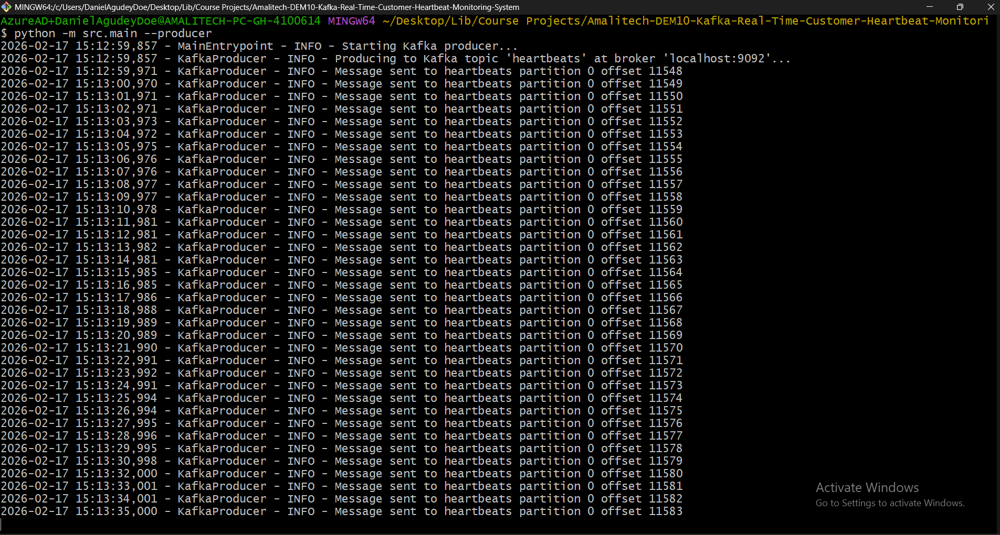
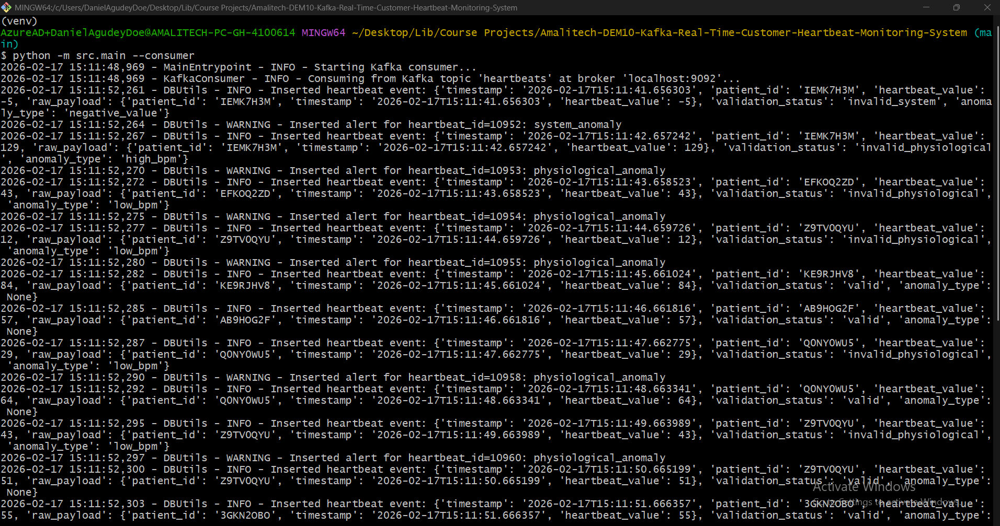
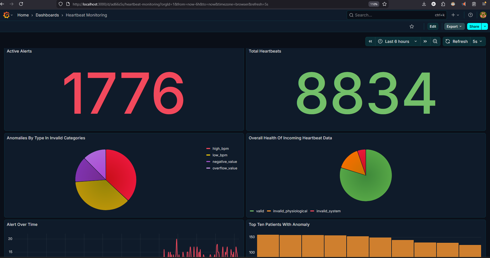
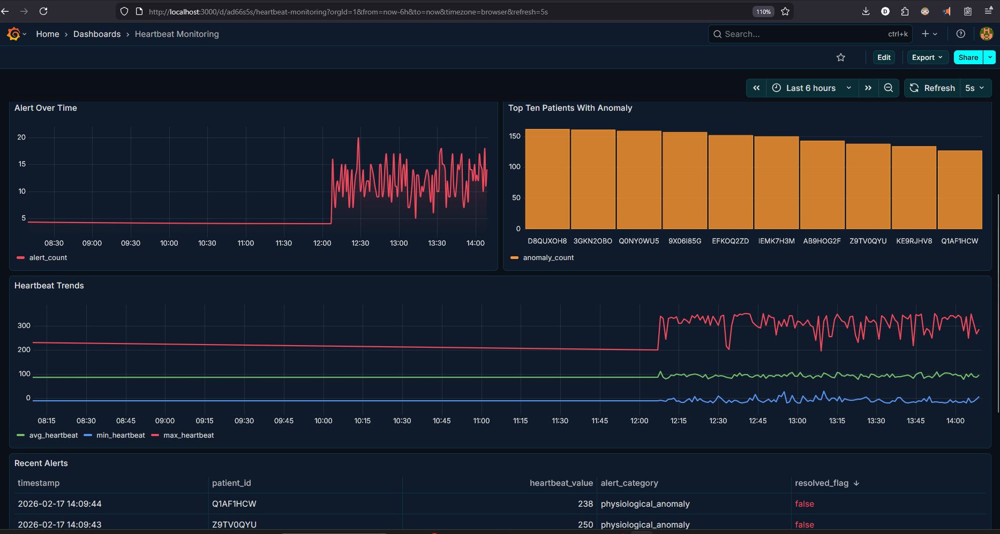
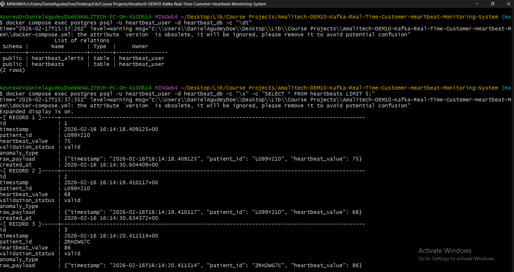
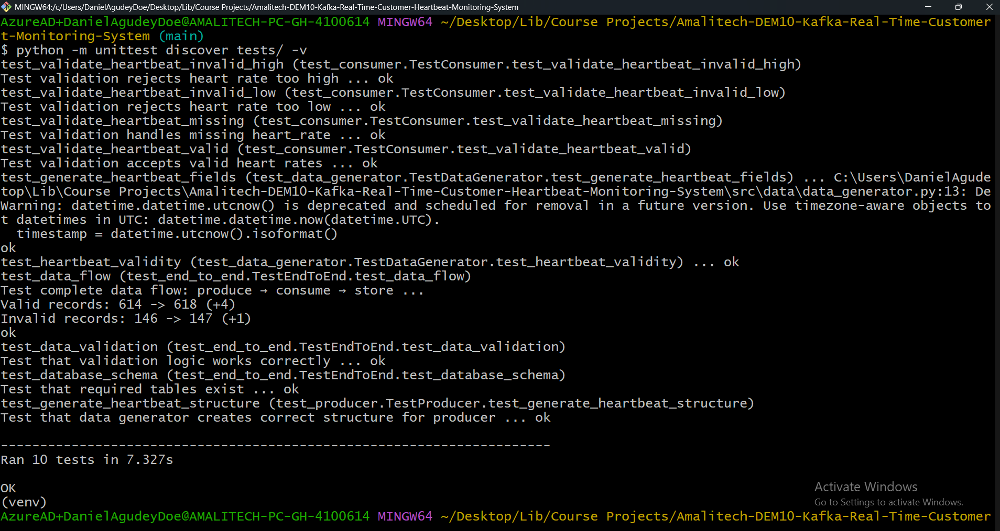

# Real-Time Customer Heartbeat Monitoring System

## Project Overview


This project implements a real-time data pipeline for monitoring customer heart rates using Apache Kafka, PostgreSQL, and Grafana. The system simulates heartbeat data from multiple customers, validates the readings in real-time, and stores ALL events in a single raw events table. Alerts for rule violations are stored in a separate alerts table. All aggregations and counts are computed dynamically in Grafana using SQL queries.


The architecture follows an event-driven pattern: synthetic heartbeat data is generated, streamed through Kafka, processed and validated, then persisted to a PostgreSQL database in a single heartbeats table. Alerts are generated for rule violations and stored in a dedicated alerts table. Grafana provides visualization and alerting using dynamic SQL queries.

## System Architecture


### Data Flow
1. **Data Generation Layer**: Python script generates synthetic heartbeat data with 80% valid (50-120 BPM) and 20% invalid readings, using the format: `patient_id`, `timestamp`, `heartbeat_value`, `status`.
2. **Message Streaming Layer**: Kafka Producer sends data to Kafka topic; Kafka Consumer reads and processes messages.
3. **Processing Layer**: Consumer validates heart rate and inserts ALL events into the `heartbeats` table, assigning a status (`valid`, `invalid_high`, `invalid_low`). If status is not `valid`, an alert is created in the `heartbeat_alerts` table.
4. **Storage Layer**: PostgreSQL stores all events in `heartbeats` and only rule violations in `heartbeat_alerts`.
5. **Visualization Layer**: Grafana dashboards provide real-time monitoring, dynamic aggregation, and alerting using SQL queries.

### Infrastructure Components
- **Zookeeper**: Manages Kafka broker coordination
- **Apache Kafka**: Message broker for real-time streaming (port 9092)
- **PostgreSQL**: Relational database for persistent storage (port 5432)
- **Grafana**: Visualization and monitoring dashboard (port 3000)

## Features

- **Real-time heartbeat data simulation** with configurable customer count
- **Data validation** (heart rate range: 50-120 BPM)
- **All events stored in a single `heartbeats` table**
- **Alerts for rule violations stored in `heartbeat_alerts`**
- **No aggregated counts stored in the database**
- **Batch processing** for efficient database writes (100 messages per batch)
- **Idempotent Kafka producer** to prevent duplicate messages
- **Manual offset commit** for data durability
- **Grafana visualization dashboard** with dynamic SQL queries and alerting
- **Comprehensive logging** (general, error, warning, info levels)
- **Connection pooling** for database efficiency
- **Unit and integration tests** for all components

## Prerequisites

- Docker & Docker Compose installed
- Python 3.10+ installed
- 4GB RAM minimum
- Ports 2181, 9092, 5432, 3000 available

## Quick Start

### 1. Clone and Setup

```bash
git clone https://github.com/Airlectric/Amalitech-DEM10-Kafka-Real-Time-Customer-Heartbeat-Monitoring-System.git
cd Amalitech-DEM10-Kafka-Real-Time-Customer-Heartbeat-Monitoring-System
cp .env.example .env
```

### 2. Start Infrastructure

```bash
docker compose up -d
```

Wait for all containers to be healthy (about 30 seconds).

#### Docker Containers Status

Once started, verify all services are running:


*All infrastructure services (Zookeeper, Kafka, PostgreSQL, Grafana) running in Docker containers*

You can check container status:
```bash
docker compose ps
```


*Container status showing all services are healthy and running on their respective ports*

### 3. Install Python Dependencies

```bash
pip install -r requirements.txt
```

### 4. Run the Pipeline

**Option A: Run both producer and consumer together**
```bash
python -m src.main.py --both
```

**Option B: Run separately (in different terminals)**
```bash
# Terminal 1 - Producer
python -m src.main.py --producer

# Terminal 2 - Consumer
python -m src.main.py --consumer
```

**Option C: Initialize database only**
```bash
python -m src.main.py --init-db
```

Press `Ctrl+C` to stop the pipeline.

### Pipeline in Action

#### Kafka Producer Running

When the producer starts, it generates synthetic heartbeat data and publishes to the Kafka topic:



*Kafka Producer generating synthetic heartbeat data from multiple patients and publishing to the `heartbeats` topic. Shows patient_id, timestamp, and heartbeat_value being sent.*

#### Kafka Consumer Processing

The consumer reads messages from Kafka, validates them, and inserts into PostgreSQL:



*Kafka Consumer reading messages from the topic, validating heartbeat values (50-120 BPM range), and inserting valid/invalid records into the database. Shows batch processing of 100 messages per commit.*

### 5. Access Grafana Dashboard

- URL: http://localhost:3000
- Username: `admin`
- Password: `admin` (or as configured in `.env`)

---

## 📊 Grafana Dashboard

### Dashboard Overview

The system includes a pre-configured Grafana dashboard with multiple panels for real-time monitoring:

**Dashboard Features:**
- 📈 **Total Heartbeats** - Live count of all heartbeat events
- 🎯 **Valid vs Invalid** - Pie chart showing data validation breakdown
- ⚠️ **Anomalies** - Classification of physiological vs system anomalies
- 🚨 **Active Alerts** - Real-time alert counter with visual indicators
- 📉 **Heartbeat Trends** - Time-series visualization of heart rate patterns
- 📋 **Recent Alerts Table** - Detailed view of recent alert events
- 📊 **Alerts Over Time** - Historical trend of alert frequency

### Dashboard Screenshots

#### First Half - Overview Panels


*Shows the top-level metrics including total heartbeats, active alerts, and validation status breakdown*

#### Second Half - Detailed Analytics


*Displays time-series trends, recent alerts table, and anomaly classifications*

### Importing the Dashboard

You can easily import the pre-configured dashboard into any Grafana instance:

#### Method 1: Import via JSON File

1. **Access Grafana**: Navigate to your Grafana instance (e.g., http://localhost:3000)
2. **Open Import**: Click **☰ (hamburger menu)** → **"Dashboards"** → **"+ New"** → **"Import"**
3. **Upload JSON**:
   - Click **"Upload dashboard JSON file"**
   - Select the file: `Heartbeat Monitoring System Dashboard Grafana.json` from the project root
   - Or copy-paste the JSON content directly into the text area
4. **Configure Data Source**:
   - Select your PostgreSQL data source from the dropdown
   - The dashboard expects a data source named "PostgreSQL" or similar
5. **Import**: Click **"Import"** button
6. **Done!** The dashboard will load with all panels configured

#### Method 2: Manual Import Steps

```bash
# The JSON file is located at:
# Heartbeat Monitoring System Dashboard Grafana.json
```

1. In Grafana, go to: **Dashboards** → **Import**
2. Click **"Upload .json File"**
3. Browse to the project directory and select: `Heartbeat Monitoring System Dashboard Grafana.json`
4. Map the data source:
   - Choose your PostgreSQL connection
   - If no data source exists, create one first (see below)
5. Click **"Import"**

#### Setting Up PostgreSQL Data Source (if needed)

If you haven't configured the PostgreSQL data source yet:

1. **Go to**: **☰** → **"Connections"** → **"Data Sources"**
2. **Add Data Source**: Click **"+ Add new data source"**
3. **Select**: **"PostgreSQL"**
4. **Configure**:
   - **Host**: `postgres:5432` (or `localhost:5432` if not using Docker)
   - **Database**: `heartbeat_db`
   - **User**: `heartbeat_user`
   - **Password**: `heartbeat_pass`
   - **SSL Mode**: `disable`
5. **Test**: Click **"Save & Test"** - should show "Database Connection OK"
6. **Return to Import**: Now import the dashboard JSON

### Dashboard JSON Location

```
project-root/
├── Heartbeat Monitoring System Dashboard Grafana.json  ← Dashboard export file
├── docker-compose.yml
├── README.md
└── ...
```

### Customizing the Dashboard

After importing, you can customize:
- **Time Range**: Default is "Last 5 minutes" - adjust as needed
- **Refresh Interval**: Default is "10s" - change for more/less frequent updates
- **Colors**: Edit panel overrides to match your preferences
- **Thresholds**: Modify alert thresholds in the "Active Alerts" panel

### Troubleshooting Import Issues

**Issue**: "Data source not found" error
- **Solution**: Create the PostgreSQL data source first (see steps above), then re-import

**Issue**: Panels show "No data"
- **Solution**: 
  - Verify the data source connection is working
  - Check that data exists in PostgreSQL (run the pipeline first)
  - Adjust the time range to include recent data

**Issue**: Colors not showing correctly
- **Solution**: 
  - Edit the panel → Go to "Overrides" tab
  - Verify field names match your database columns
  - Check the Value Mappings configuration

---

## 📦 Database Verification

After running the pipeline, verify that data is being stored correctly in PostgreSQL:

### Heartbeats Table

The main table stores ALL heartbeat events (both valid and invalid):



*PostgreSQL `heartbeats` table showing records with:
- Valid readings (50-120 BPM) marked with `validation_status = 'valid'`
- Invalid physiological readings marked with `validation_status = 'invalid_physiological'`
- System anomalies marked with `validation_status = 'invalid_system'`
- Corrupted data marked with `validation_status = 'corrupted'`
- Associated `anomaly_type` for invalid records*

### Heartbeat Alerts Table

The alerts table stores only rule violations for monitoring:


*PostgreSQL `heartbeat_alerts` table showing alert records with:
- Reference to the original heartbeat record (`heartbeat_id`)
- Alert categories: physiological_anomaly, system_anomaly, data_corruption
- `resolved_flag` to track if alert has been addressed
- Patient identification and heartbeat value at time of alert*

---

## 🧪 Testing Results

All components include comprehensive unit and integration tests:

### Test Suite Results



*Complete test suite execution showing:
- ✅ Data generator tests (synthetic heartbeat generation)
- ✅ Kafka producer tests (message publishing)
- ✅ Kafka consumer tests (message processing and validation)
- ✅ End-to-end pipeline tests (full integration)
- All tests passing with detailed output*

### Running Tests

```bash
# Run all tests
python -m unittest discover tests/ -v
```

---

## Project Structure

```
project-root/
├── docker-compose.yml       # Infrastructure setup (Kafka, PostgreSQL, Grafana)
├── Dockerfile              # Python application container
├── requirements.txt        # Python dependencies
├── .env                    # Environment variables
├── .env.example            # Environment template
├── db/
│   └── schema.sql          # Database schema definition
├── src/
│   ├── config/             # Configuration and logging
│   │   ├── config.py       # Environment-based configuration
│   │   └── logger.py       # Logging setup
│   ├── data/               # Data generation
│   │   └── data_generator.py
│   ├── kafka/              # Kafka components
│   │   ├── producer.py     # Kafka producer
│   │   └── consumer.py     # Kafka consumer with validation
│   ├── db/                 # Database utilities
│   │   └── db_utils.py     # Connection pooling and inserts
│   └── main.py             # Application entry point
├── tests/                  # Unit and integration tests
│   ├── test_data_generator.py
│   ├── test_producer.py
│   ├── test_consumer.py
│   └── test_end_to_end.py
├── logs/                   # Application logs
│   ├── general.log
│   ├── error.log
│   ├── info.log
│   └── warning.log
├── docs/                   # Documentation
│   ├── setup_guide.md
│   ├── system_architecture.md
│   └── Workflow_Diagram.png

```

## Testing

### Run All Tests
```bash
python -m unittest discover tests/ -v
```

### Run Individual Tests
```bash
# Test data generator
python -m unittest tests.test_data_generator -v

# Test Kafka producer
python -m unittest tests.test_producer -v

# Test Kafka consumer
python -m unittest tests.test_consumer -v

# Test end-to-end pipeline
python -m unittest tests.test_end_to_end -v
```

### Verify Pipeline Manually

```bash
# Check database records
docker compose exec postgres psql -U heartbeat_user -d heartbeat_db -c "SELECT COUNT(*) FROM heartbeats;"
docker compose exec postgres psql -U heartbeat_user -d heartbeat_db -c "SELECT COUNT(*) FROM heartbeats_alerts;"

# View recent records
docker compose exec postgres psql -U heartbeat_user -d heartbeat_db -c "SELECT * FROM heartbeats ORDER BY timestamp DESC LIMIT 5;"
```

## Data Schema


### Heartbeats Table
```sql
CREATE TABLE heartbeats (
    id SERIAL PRIMARY KEY,
    timestamp TIMESTAMPTZ NOT NULL,
    patient_id VARCHAR(50) NOT NULL,
    heartbeat_value NUMERIC,
    validation_status VARCHAR NOT NULL CHECK (validation_status IN ('valid', 'invalid_physiological', 'invalid_system', 'corrupted')),
    anomaly_type VARCHAR,
    raw_payload JSONB,
    created_at TIMESTAMPTZ DEFAULT CURRENT_TIMESTAMP,
    CONSTRAINT anomaly_type_null_if_valid CHECK (
        (validation_status = 'valid' AND anomaly_type IS NULL)
        OR (validation_status != 'valid')
    )
);
CREATE INDEX idx_heartbeats_timestamp ON heartbeats (timestamp);
CREATE INDEX idx_heartbeats_patient_id ON heartbeats (patient_id);
```

### Heartbeat Alerts Table
```sql
CREATE TABLE heartbeat_alerts (
    alert_id SERIAL PRIMARY KEY,
    heartbeat_id INTEGER REFERENCES heartbeats(id) ON DELETE CASCADE,
    timestamp TIMESTAMPTZ NOT NULL,
    patient_id VARCHAR(50),
    heartbeat_value NUMERIC,
    alert_category VARCHAR NOT NULL CHECK (alert_category IN ('physiological_anomaly', 'system_anomaly', 'data_corruption')),
    resolved_flag BOOLEAN DEFAULT FALSE,
    created_at TIMESTAMPTZ DEFAULT CURRENT_TIMESTAMP
);
CREATE INDEX idx_heartbeat_alerts_timestamp ON heartbeat_alerts (timestamp);
```

## Configuration

### Environment Variables

| Variable | Default | Description |
|----------|---------|-------------|
| POSTGRES_USER | heartbeat_user | PostgreSQL username |
| POSTGRES_PASSWORD | heartbeat_pass | PostgreSQL password |
| POSTGRES_DB | heartbeat_db | Database name |
| POSTGRES_HOST | localhost | Database host |
| POSTGRES_PORT | 5432 | Database port |
| KAFKA_BROKER | localhost:9092 | Kafka broker address |
| KAFKA_TOPIC | heartbeats | Kafka topic name |
| CUSTOMER_COUNT | 10 | Number of simulated customers |
| HEART_RATE_MIN | 50 | Minimum valid BPM |
| HEART_RATE_MAX | 120 | Maximum valid BPM |
| INVALID_HEART_RATE_MIN | 30 | Minimum invalid BPM |
| INVALID_HEART_RATE_MAX | 200 | Maximum invalid BPM |
| GF_SECURITY_ADMIN_USER | admin | Grafana admin username |
| GF_SECURITY_ADMIN_PASSWORD | admin | Grafana admin password |
| LOG_LEVEL | INFO | Logging level |

## Monitoring

### Logs Location
- `logs/general.log` - All log messages
- `logs/error.log` - Error messages only
- `logs/info.log` - Info messages only
- `logs/warning.log` - Warning messages only


### Example Database Queries (for Grafana panels)

```sql
-- View recent heartbeats
SELECT * FROM heartbeats 
ORDER BY timestamp DESC 
LIMIT 10;

-- Count by validation_status
SELECT validation_status, COUNT(*) as count 
FROM heartbeats 
GROUP BY validation_status;

-- Heart rate statistics by patient
SELECT 
    patient_id,
    MIN(heartbeat_value) as min_hr,
    MAX(heartbeat_value) as max_hr,
    AVG(heartbeat_value)::NUMERIC(10,2) as avg_hr,
    COUNT(*) as total_records
FROM heartbeats
WHERE validation_status = 'valid'
GROUP BY patient_id;

-- Recent alerts
SELECT * FROM heartbeat_alerts 
ORDER BY timestamp DESC 
LIMIT 10;

-- Count alerts by category
SELECT alert_category, COUNT(*) as count 
FROM heartbeat_alerts 
GROUP BY alert_category;
```

## Troubleshooting

### Issue: Containers won't start
**Solution:** Check if required ports are available
```bash
# Check port usage
netstat -ano | findstr "2181\|9092\|5432\|3000"

# Restart containers
docker compose down
docker compose up -d
docker compose logs <service_name>
```

### Issue: Kafka connection refused
**Solution:** Wait for Zookeeper to be fully initialized (about 30 seconds), then check logs:
```bash
docker compose logs zookeeper
docker compose logs kafka
```

### Issue: Database connection failed
**Solution:** Verify PostgreSQL is healthy
```bash
docker compose ps
docker compose logs postgres
```

### Issue: Permission denied errors
**Solution:** On Linux/Mac, fix permissions:
```bash
chmod -R 755 logs/
chmod -R 755 db/
```

## Quick Reference Commands

```bash
# Start all services
docker compose up -d

# View service logs
docker compose logs -f

# Terminal 1
python -m src.main  --producer

# Terminal 2
python -m src.main  --consumer

# Run the complete pipeline
python -m src.main.py --both

# Run tests
python -m unittest discover tests/ -v

# Access database
docker compose exec postgres psql -U heartbeat_user -d heartbeat_db

# Stop all services
docker compose down

# Reset database (WARNING: deletes all data)
docker compose down -v
docker compose up -d
```

## License

MIT

---

**Author:** Doe Agudey Daniel 
**Project:** Amalitech-DEM10 Kafka Real-Time Customer Heartbeat Monitoring System  
**Last Updated:** 2026-02-16
