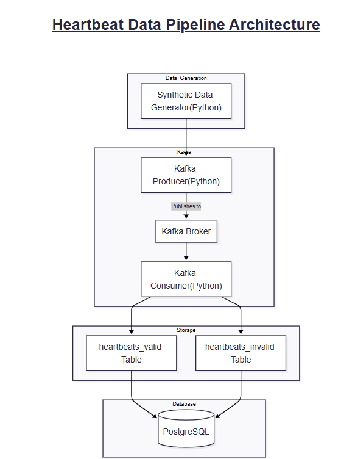

# Real-Time Customer Heartbeat Monitoring System

## Project Overview

This project implements a real-time data pipeline for monitoring customer heart rates using Apache Kafka, PostgreSQL, and Grafana. The system simulates heartbeat data from multiple customers, validates the readings in real-time, and stores valid and invalid records separately for analysis.

The architecture follows a producer-consumer pattern where synthetic heartbeat data is generated, streamed through Kafka, processed and validated, then persisted to a PostgreSQL database. Grafana provides visualization capabilities for monitoring heart rate trends and data quality metrics.

## System Architecture



### Data Flow
1. **Data Generation Layer**: Python script generates synthetic heartbeat data with 80% valid (50-120 BPM) and 20% invalid readings
2. **Message Streaming Layer**: Kafka Producer sends data to Kafka topic; Kafka Consumer reads and processes messages
3. **Processing Layer**: Consumer validates heart rate ranges and routes data to appropriate tables
4. **Storage Layer**: PostgreSQL stores valid records in `heartbeats_valid` and invalid records in `heartbeats_invalid`
5. **Visualization Layer**: Grafana dashboards provide real-time monitoring and historical analysis

### Infrastructure Components
- **Zookeeper**: Manages Kafka broker coordination
- **Apache Kafka**: Message broker for real-time streaming (port 9092)
- **PostgreSQL**: Relational database for persistent storage (port 5432)
- **Grafana**: Visualization and monitoring dashboard (port 3000)

## Features

- **Real-time heartbeat data simulation** with configurable customer count
- **Data validation** (heart rate range: 50-120 BPM)
- **Separate storage** for valid/invalid records with error reasons
- **Batch processing** for efficient database writes (100 messages per batch)
- **Idempotent Kafka producer** to prevent duplicate messages
- **Manual offset commit** for data durability
- **Grafana visualization dashboard** with multiple panels
- **Comprehensive logging** (general, error, warning, info levels)
- **Connection pooling** for database efficiency
- **Unit and integration tests** for all components

## Prerequisites

- Docker & Docker Compose installed
- Python 3.10+ installed
- 4GB RAM minimum
- Ports 2181, 9092, 5432, 3000 available

## Quick Start

### 1. Clone and Setup

```bash
git clone https://github.com/Airlectric/Amalitech-DEM10-Kafka-Real-Time-Customer-Heartbeat-Monitoring-System.git
cd Amalitech-DEM10-Kafka-Real-Time-Customer-Heartbeat-Monitoring-System
cp .env.example .env
```

### 2. Start Infrastructure

```bash
docker compose up -d
```

Wait for all containers to be healthy (about 30 seconds).

### 3. Install Python Dependencies

```bash
pip install -r requirements.txt
```

### 4. Run the Pipeline

**Option A: Run both producer and consumer together**
```bash
python src/main.py --both
```

**Option B: Run separately (in different terminals)**
```bash
# Terminal 1 - Producer
python src/main.py --producer

# Terminal 2 - Consumer
python src/main.py --consumer
```

**Option C: Initialize database only**
```bash
python src/main.py --init-db
```

Press `Ctrl+C` to stop the pipeline.

### 5. Access Grafana Dashboard

- URL: http://localhost:3000
- Username: `admin`
- Password: `admin` (or as configured in `.env`)

## Project Structure

```
project-root/
├── docker-compose.yml       # Infrastructure setup (Kafka, PostgreSQL, Grafana)
├── Dockerfile              # Python application container
├── requirements.txt        # Python dependencies
├── .env                    # Environment variables
├── .env.example            # Environment template
├── db/
│   └── schema.sql          # Database schema definition
├── src/
│   ├── config/             # Configuration and logging
│   │   ├── config.py       # Environment-based configuration
│   │   └── logger.py       # Logging setup
│   ├── data/               # Data generation
│   │   └── data_generator.py
│   ├── kafka/              # Kafka components
│   │   ├── producer.py     # Kafka producer
│   │   └── consumer.py     # Kafka consumer with validation
│   ├── db/                 # Database utilities
│   │   └── db_utils.py     # Connection pooling and inserts
│   └── main.py             # Application entry point
├── tests/                  # Unit and integration tests
│   ├── test_data_generator.py
│   ├── test_producer.py
│   ├── test_consumer.py
│   └── test_end_to_end.py
├── logs/                   # Application logs
│   ├── general.log
│   ├── error.log
│   ├── info.log
│   └── warning.log
├── docs/                   # Documentation
│   ├── setup_guide.md
│   ├── system_architecture.md
│   └── Workflow_Diagram.png
└── notes/                  # Project notes
    ├── project_instructions.md
    └── COMPLETION_GUIDE.md
```

## Testing

### Run All Tests
```bash
python -m unittest discover tests/ -v
```

### Run Individual Tests
```bash
# Test data generator
python -m unittest tests.test_data_generator -v

# Test Kafka producer
python -m unittest tests.test_producer -v

# Test Kafka consumer
python -m unittest tests.test_consumer -v

# Test end-to-end pipeline
python -m unittest tests.test_end_to_end -v
```

### Verify Pipeline Manually

```bash
# Check database records
docker compose exec postgres psql -U heartbeat_user -d heartbeat_db -c "SELECT COUNT(*) FROM heartbeats_valid;"
docker compose exec postgres psql -U heartbeat_user -d heartbeat_db -c "SELECT COUNT(*) FROM heartbeats_invalid;"

# View recent records
docker compose exec postgres psql -U heartbeat_user -d heartbeat_db -c "SELECT * FROM heartbeats_valid ORDER BY timestamp DESC LIMIT 5;"
```

## Data Schema

### Valid Heartbeats Table
```sql
CREATE TABLE heartbeats_valid (
    id SERIAL PRIMARY KEY,
    customer_id VARCHAR(50) NOT NULL,
    timestamp TIMESTAMPTZ NOT NULL,
    heart_rate INTEGER NOT NULL,
    anomaly BOOLEAN DEFAULT FALSE,
    CONSTRAINT unique_heartbeat_valid UNIQUE (customer_id, timestamp)
);
CREATE INDEX idx_heartbeats_valid_timestamp ON heartbeats_valid (timestamp);
```

### Invalid Heartbeats Table
```sql
CREATE TABLE heartbeats_invalid (
    id SERIAL PRIMARY KEY,
    customer_id VARCHAR(50),
    timestamp TIMESTAMPTZ,
    heart_rate INTEGER,
    error_reason TEXT NOT NULL,
    received_at TIMESTAMPTZ DEFAULT NOW(),
    CONSTRAINT unique_heartbeat_invalid UNIQUE (customer_id, timestamp)
);
CREATE INDEX idx_heartbeats_invalid_timestamp ON heartbeats_invalid (timestamp);
```

## Configuration

### Environment Variables

| Variable | Default | Description |
|----------|---------|-------------|
| POSTGRES_USER | heartbeat_user | PostgreSQL username |
| POSTGRES_PASSWORD | heartbeat_pass | PostgreSQL password |
| POSTGRES_DB | heartbeat_db | Database name |
| POSTGRES_HOST | localhost | Database host |
| POSTGRES_PORT | 5432 | Database port |
| KAFKA_BROKER | localhost:9092 | Kafka broker address |
| KAFKA_TOPIC | heartbeats | Kafka topic name |
| CUSTOMER_COUNT | 10 | Number of simulated customers |
| HEART_RATE_MIN | 50 | Minimum valid BPM |
| HEART_RATE_MAX | 120 | Maximum valid BPM |
| INVALID_HEART_RATE_MIN | 30 | Minimum invalid BPM |
| INVALID_HEART_RATE_MAX | 200 | Maximum invalid BPM |
| GF_SECURITY_ADMIN_USER | admin | Grafana admin username |
| GF_SECURITY_ADMIN_PASSWORD | admin | Grafana admin password |
| LOG_LEVEL | INFO | Logging level |

## Monitoring

### Logs Location
- `logs/general.log` - All log messages
- `logs/error.log` - Error messages only
- `logs/info.log` - Info messages only
- `logs/warning.log` - Warning messages only

### Database Queries

```sql
-- View recent valid heartbeats
SELECT * FROM heartbeats_valid 
ORDER BY timestamp DESC 
LIMIT 10;

-- View invalid heartbeats with reasons
SELECT * FROM heartbeats_invalid 
ORDER BY received_at DESC 
LIMIT 10;

-- Count records by customer
SELECT customer_id, COUNT(*) as record_count 
FROM heartbeats_valid 
GROUP BY customer_id 
ORDER BY record_count DESC;

-- Heart rate statistics
SELECT 
    customer_id,
    MIN(heart_rate) as min_hr,
    MAX(heart_rate) as max_hr,
    AVG(heart_rate)::NUMERIC(10,2) as avg_hr,
    COUNT(*) as total_records
FROM heartbeats_valid
GROUP BY customer_id;

-- Invalid data summary
SELECT 
    error_reason,
    COUNT(*) as count
FROM heartbeats_invalid
GROUP BY error_reason;
```

## Troubleshooting

### Issue: Containers won't start
**Solution:** Check if required ports are available
```bash
# Check port usage
netstat -ano | findstr "2181\|9092\|5432\|3000"

# Restart containers
docker compose down
docker compose up -d
docker compose logs <service_name>
```

### Issue: Kafka connection refused
**Solution:** Wait for Zookeeper to be fully initialized (about 30 seconds), then check logs:
```bash
docker compose logs zookeeper
docker compose logs kafka
```

### Issue: Database connection failed
**Solution:** Verify PostgreSQL is healthy
```bash
docker compose ps
docker compose logs postgres
```

### Issue: Permission denied errors
**Solution:** On Linux/Mac, fix permissions:
```bash
chmod -R 755 logs/
chmod -R 755 db/
```

## Quick Reference Commands

```bash
# Start all services
docker compose up -d

# View service logs
docker compose logs -f

# Run the complete pipeline
python src/main.py --both

# Run tests
python -m unittest discover tests/ -v

# Access database
docker compose exec postgres psql -U heartbeat_user -d heartbeat_db

# Stop all services
docker compose down

# Reset database (WARNING: deletes all data)
docker compose down -v
docker compose up -d
```

## License

[Add your license information here]

---

**Author:** Doe Agudey Daniel 
**Project:** Amalitech-DEM10 Kafka Real-Time Customer Heartbeat Monitoring System  
**Last Updated:** 2026-02-16
